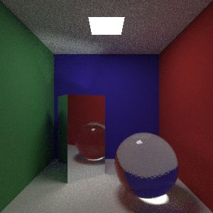
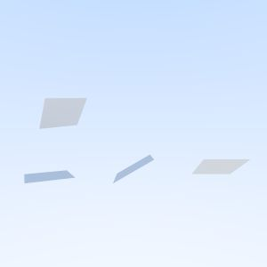

# Scenes

Here are all the currently available scenes with small representative renders.

## cornell-box

## cornell-box-advanced

## floating-sphere

This is a very costly scene!

## Test

Scenes that were deliberately made for testing purposes. These are usually very simple and are set up in such a way that
one aspect of the rendering could be inspected conveniently.

## test-cuboid-emissive

## test-cuboid-inside-lambertian

## test-cuboid-inside-metal

## test-cuboid-material

## test-cuboid-rotate

## test-cuboid-scale

## test-icosphere-emissive

## test-icosphere-inside-lambertian

## test-icosphere-inside-metal

## test-icosphere-material

## test-icosphere-rotate

## test-icosphere-scale

## test-plane-emissive

## test-plane-material

## test-plane-material-collision-direction

## test-plane-rotate

## test-plane-scale

